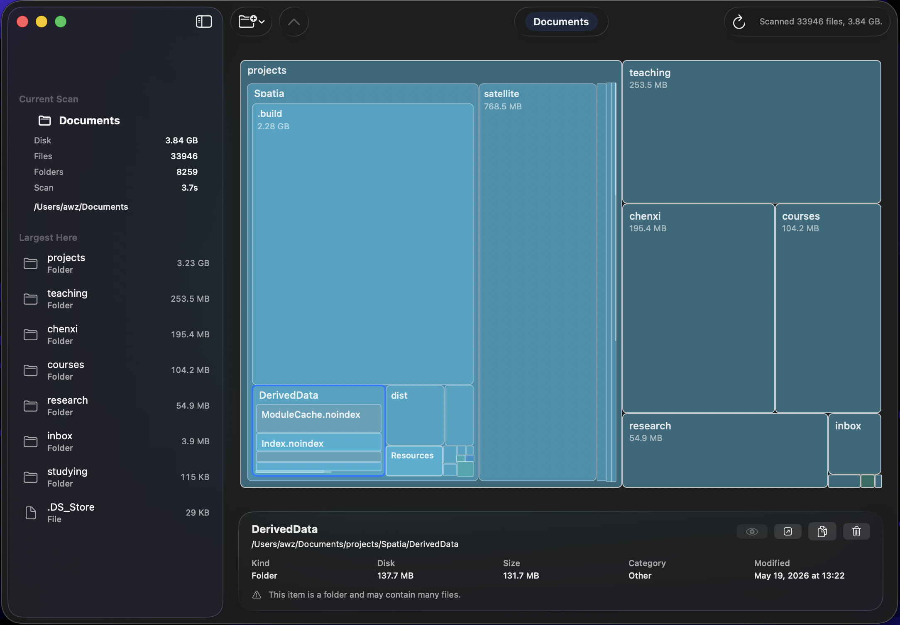
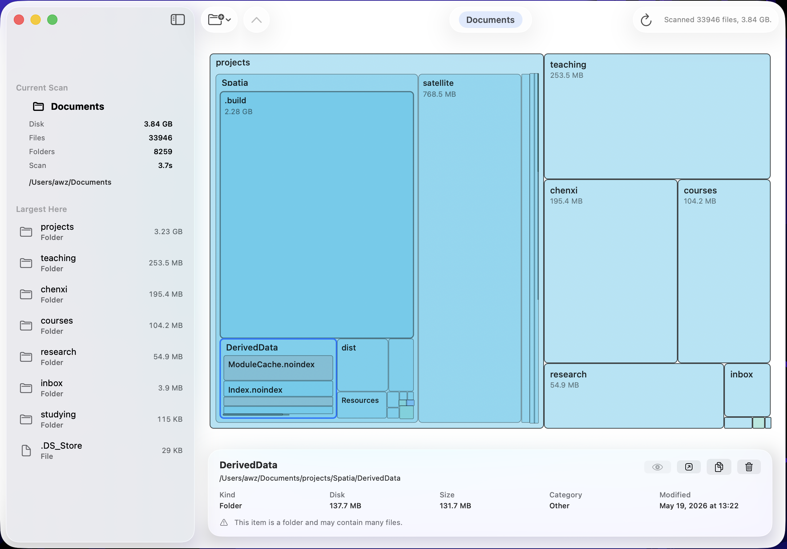

# Spatia

<p align="center">
  
</p>

[](LICENSE)


[](.github/workflows/ci.yml)
[](VERSION)

Spatia is a native macOS disk space visualizer built around a SpaceSniffer-style treemap.

It is a file space map, not a Mac cleaner. Scans are user initiated, results stay local, and the app does not run telemetry, background indexing, automatic cleanup, or permanent deletion.

<p align="center">
  
</p>

## Features

- Scan Downloads, Desktop, Documents, Applications, Home, or a chosen folder.
- Visualize disk usage with a recursive rectangular treemap.
- Navigate into large folders with breadcrumbs.
- Inspect disk usage, logical size, kind, category, modified date, and path.
- Quick Look files, reveal items in Finder, and copy paths.
- Move selected items to Trash after safety checks and confirmation.
- Summarize unreadable locations without interrupting the scan.

## Screenshots

Spatia follows the system appearance and works in light mode as well.

<p align="center">
  
</p>

## Status

Spatia is pre-1.0 macOS software.

- Minimum macOS: 26.
- Current version: see [VERSION](VERSION).
- Distribution target: GitHub Releases.
- Notarization: deferred for early releases.
- App Store: not planned for the first phase.
- Deletion: limited to selected-item Move to Trash; permanent deletion and bulk deletion are not implemented.

## Product Boundaries

Spatia is deliberately a visual explorer, not a Mac cleaner.

- Show and explain disk usage before offering actions.
- Keep filesystem access explicit and user initiated.
- Use safe macOS actions first: Quick Look, Reveal in Finder, Copy Path, and Move to Trash.
- Limit deletion to one selected item, only after safety checks and confirmation.
- Summarize inaccessible locations without pressuring the user to grant broad permissions.
- Avoid cleanup recommendations, system optimization claims, background indexing, telemetry, cloud sync, permanent deletion, and automatic cleanup.

## Build From Source

Requirements:

- macOS 26 or newer
- Xcode 26 or newer recommended
- Swift 6.2 or newer

```sh
./Scripts/check-version.sh
./Scripts/check-env.sh
./Scripts/build-debug.sh
./Scripts/test.sh
```

Create local unsigned artifacts:

```sh
SKIP_CODESIGN=1 ./Scripts/package-app.sh
SKIP_CODESIGN=1 ./Scripts/package-dmg.sh
```

Open `Package.swift` in Xcode for native UI work.

Release builds are created from version tags. Pushes to `main` run CI and unsigned packaging smoke tests only; pushing a tag such as `v0.1.0` creates a draft prerelease with the unsigned DMG and checksum attached.

## Current Limitations

- Early release artifacts are unsigned and not notarized.
- Protected folders may produce partial scan results until the user grants Full Disk Access.
- Move to Trash is available only for the selected item after safety checks and confirmation.
- Permanent deletion, bulk deletion, automatic cleanup, and cleanup recommendations are not implemented.
- Displayed allocated size may not equal recoverable space on APFS because of clones, sparse files, compression, purgeable data, iCloud placeholders, and snapshots.

## Privacy And Permissions

Spatia keeps scan results local. It does not upload file names or paths, collect telemetry, run a background daemon, or scan locations without user action.

The first release does not ask for Full Disk Access on launch. Users can scan Downloads, Desktop, Documents, Applications, Home, or a chosen folder. If protected locations cannot be read, Spatia keeps the partial result and reports unreadable paths.

## Project Layout

- `Sources/Spatia`: macOS app target.
- `Sources/SpatiaCore`: scanner, model, formatting, treemap layout, hit testing, and safety rules.
- `Sources/SpatiaBenchmarks`: synthetic scanner benchmark target.
- `Tests`: scanner, treemap, navigation, category, hit-testing, and safety-policy tests.
- `Docs`: architecture and release notes.

## Documentation

- [Architecture](Docs/architecture.md)
- [Release](Docs/release.md)
- [Contributing](CONTRIBUTING.md)
- [Security](SECURITY.md)

## Contributing

See [CONTRIBUTING.md](CONTRIBUTING.md). Contributions should keep filesystem access explicit, preserve local-first privacy, and avoid telemetry, background daemons, permanent deletion, and automatic cleanup logic.

## License

Spatia is licensed under the [Apache License 2.0](LICENSE).
